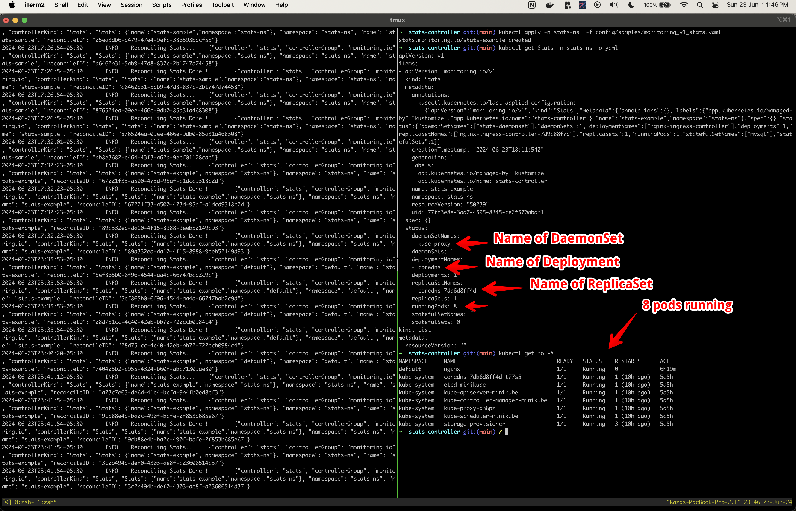

# Kubernetes Custom Controller

This is a Kubernetes custom controller built using Kubebuilder. The controller monitors and updates the status of custom resources of kind `Stats` in a Kubernetes cluster.

## Project Structure

- `api/v1/stats_types.go`: Defines the `Stats` resource's API schema.
- `internal/controller/stats_controller.go`: Implements the reconciliation logic for the `Stats` custom resource.
- `config/samples/monitoring_v1_stats.yaml`: Sample CRD to create a `Stats` custom resource.

## Prerequisites

- Kubernetes cluster (e.g., Minikube, Kind, or a cloud provider's Kubernetes service). I have used a local Minikube cluster for testing on my Macbook Pro M1 machine.
- Kubebuilder installed ([installation guide](https://book.kubebuilder.io/quick-start.html#installation))

## Getting Started

### Step 1: Clone the Repository

```bash
git clone https://github.com/razasayed/stats-controller.git
cd stats-controller
```

### Step 2: Install the CRDs

```bash
make manifests
make install
```

### Step 3: Run the Controller

```bash
make run
```

### Step 4: Create a `Stats` Resource

```bash
kubectl apply -f config/samples/monitoring_v1_stats.yaml
```

### Step 5: Verify the Resource was created

```bash
kubectl get Stats -o yaml
```

Alternatively, we can also create the resource in a custom namespace (i created one called stats-ns) as follows:

```bash
kubectl create ns stats-ns
kubectl apply -n stats-ns -f config/samples/monitoring_v1_stats.yaml
kubectl get Stats -n stats-ns -o yaml
```

### Screenshot

The below screenshot shows the Stats controller running the reconciliation loop in the left pane. In the right pane, i created a `Stats` resource and the controller updated the status of the resource.
This was verified by running `kubectl get Stats -n stats-ns -o yaml` in the right pane. We can see that the status of various resources for example the number of currently running pods and the names of resources like Deployments, ReplicaSets and DaemonSets is correctly 
shown in the status section of the `Stats` resource.




